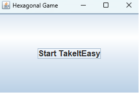
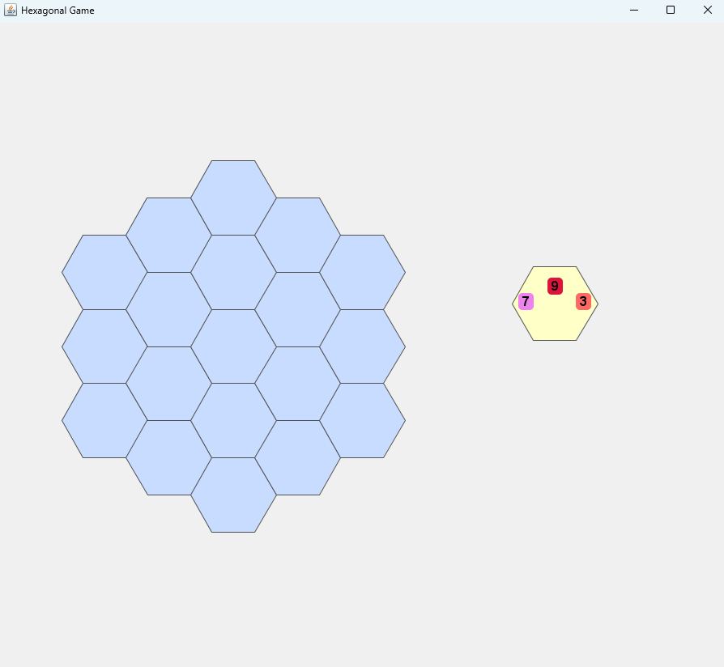
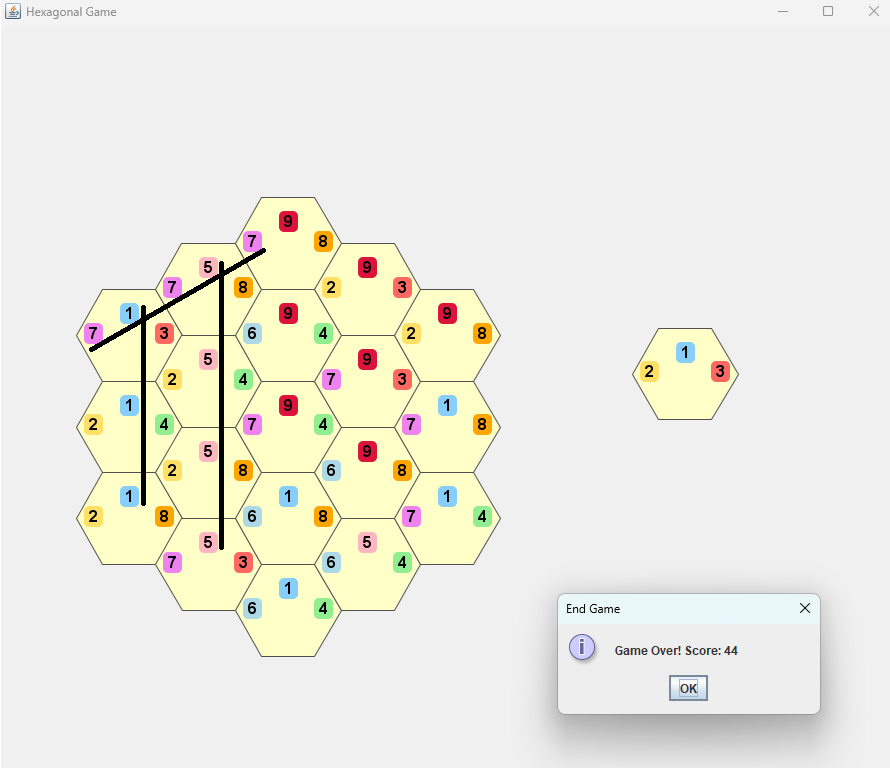

# Take It Easy - Java Implementation

## The game

This is a simplified, single-player version of the board game **"Take It Easy"** by Peter Burley, written in **Java**. The project follows the **Model-View-Controller (MVC) pattern**, commonly used for developing user interfaces that divides the related program logic into three interconnected elements.

This version follows the original **Take It Easy** rules: tiles are placed without rotation (in the board game, tiles have to be placed so the numbers displayed on them remain upright). The board consists of **19 hexagonal slots** where the player places drawn tiles. The goal is to align paths to maximize points.

---

### Start the game

### Prerequisites
Make sure you have at least **Java 21** and at least **Gradle 8.0** installed on your system.

### Clone the Repository
```sh
 git clone https://github.com/FlaviaDS/TakeItEasy.git
 cd TakeItEasy
```

### Run the Game
#### Windows
```sh
 ./gradlew.bat :launcher:run
```
#### Linux and macOS
```sh
 ./gradlew :launcher:run
```

At the start, the launcher initiates the game

<p align="center">
  
</p>

When clicked upon, the Start button brings the player to this screen with the empy board and the first available tile ready to be placed.

<p align="center">
  
</p>

---

### Rules
- Each turn, a **random tile** is drawn from a **deck of 27 tiles**.
- The player must **place the tile** in one of the 19 empty hexagonal slots, at his/her choice.
- Tiles are placed as drawn.
- Repeat until the **board is full**.
- The **score** is calculated based on complete paths sharing the same number.

### How Scoring Works
- A **complete path** (vertical, diagonal-left, diagonal-right) **earns points** (i.e., the line made of same numbers must run from one edge of the board to the opposite one).
- The score of a path = **path number × number of tiles in that path**.
- If a path contains a mismatching number, it scores 0 points.
Example: If a **completed path** of **5 tiles** contains the number **8**, the path earns **8 × 5 = 40 points**.

<p align="center">
  
</p>

In the image, the score is 7 x 3 + 1 x 3 + 5 x 4 = 44.

---

## User Interface (UI) Controls
The game uses **Swing** for a simple GUI:
- The **board** consists of **19 hexagonal slots**.
- The **next tile** is displayed **before placement**.
- Click a **valid empty slot** to place the tile.
- The game **ends when the board is full**, showing the final score.

---

## Repository Structure

```
TakeItEasy
│
├── launcher/
│   ├── src/main/java/org/example/
│   │   ├── Launcher.java
│   ├── build.gradle.kts
│
├── hexagonal/
│   ├── src/main/java/org/example/
│   │   ├── control/
|           ├── GameController.java
│   │   ├── model/
|           ├── CubeCoordinates.java
|           ├── HexagonalGameBaord.java
|           ├── HexTile.java
│   │   ├── view/
|           ├── HexGridPanel.java
            ├── HexGridRenderer.java
│   │   ├── utils/
|           ├── TileDeckManager.java
|           ├── TileLoader.java
│   ├── src/test/java/org/example/
│   │   ├── HexagonalGameBoardTest.java
│   ├── build.gradle.kts
│
├── .github/workflows/
├── .gradle/wrapper/
├── .idea/
├── .gitignore
├── settings.gradle.kts
├── gradlew
├── gradlew.bat
├── quodana.yaml
└── README.md

```

---

## Development
### Design Pattern
The project follows the **MVC Pattern**:
- **Model** → Defines the game board, tiles, and score calculation.
- **View** → Handles the **Swing GUI**.
- **Controller** → Manages **game logic & input handling**.

### Technologies Used
- **Java 23.0.1**
- **Gradle 8.10** (build automation)
- **JUnit 5** (unit testing)
- **Jackson** (JSON parsing for tiles)
- **Swing** (graphical user interface)

### Dependencies
```gradle
dependencies {
    implementation ("com.fasterxml.jackson.core:jackson-databind:2.15.0")
    testImplementation (platform("org.junit:junit-bom:5.10.0"))
    testImplementation ("org.junit.jupiter:junit-jupiter")
}
```

---

### Architecture

The code is organised in different folders, separating tasks:

- The hexagonal/src/main/java/org/example/control/ implements the game logic and initialization.
- The hexagonal/src/main/java/org/example/model/ package implements the core game model for a hexagonal board game, defining the game’s structure, tile interactions, and scoring system.
- A utils package hexagonal/src/main/java/org/example/utils/, contains utility functions for the classes.
- The hexagonal/src/main/java/org/example/view/ package implements the UI using Swing.
- The hexagonal/src/main/java/org/example/Main.java class initializes and launches the Swing-based game window. 

The application entrypoint is defined in the Launcher class contained in launcher/src/main/java/org/example/, which launches the application.

control

- GameController: the class manages the core game logic for a hexagonal board game. It initializes the game board and tile deck, handles tile placement on the board, tracks the current tile to be placed, updates the game state (e.g. drawing new tiles), checks for game-over conditions, and gives access to the score and board state. It acts as a bridge between the game model and UI.

model

- CubeCoordinates: The CubeCoordinates record implements hexagonal grid logic using axial cube coordinates. It puts cube coordinate constraint: x + y + z = 0, provides 6 directional vectors for hexagonal movement, calculates adjacent tile positions, creates hexagonal rings of coordinates. It is essential for hexagonal grid calculations in games, handling spatial relationships and coordinate system conversions.
- HexagonalGameBoard: The HexagonalGameBoard class manages a hexagonal game board and implements gameplay logic. It maintains a 19-tile hexagonal board, tracks tile placement validity, manages the scoring system (a valid line earns line_length × value if all tiles share the same value in the evaluated direction, and scores lines span from board edge to edge, in three directions).
- HexTile: represents a hexagonal game tile with three directional path values. It builds them storing numeric values for three edges: topPath, rightPath, leftPath. Tile properties remain constant after creation.

utils

- TileDeckManager: is used to handle the tiles during a game, guaranteeing that they are shuffled before the game and drawn one at a time; it also monitors the remaining tiles from the deck of 27.
- TileLoader: this class loads a predefined set of hexagonal tiles (HexTile) from a JSON string. It uses Jackson's ObjectMapper to parse the JSON into a list of maps, then converts each entry into a HexTile object. This ensures that the game starts with a standard set of tiles without requiring an external file. If an error occurs during loading, a RuntimeException is thrown.
    
view

- HexGridPanel: it is a Swing JPanel that displays and manages the hexagonal game board. It initializes a GameController and a HexGridRenderer to handle game logic and rendering. It handles user input, detecting mouse clicks to place tiles on the board. It resizes the board dynamically, adjusting sizes when the panel is resized; it renders the board, calling HexGridRenderer to draw the board. Finally, it checks the game over situation.
- HexGridRenderer: this class handles rendering the hexagonal game board in Swing. It dynamically calculates hex positions, draws tiles, and displays tile numbers with color-coded highlights. It adapts to window resizing, adjusting hex sizes, detects mouse clicks to determine which hex is selected, previews the next tile before placement and uses cube coordinates for accurate hexagonal positioning. This class ensures visual game rendering while integrating with the GameController.
    
In this implementation, a MVC-based approach was followed, with some design choices that match game mechanics and implementation needs.

Regarding access modifiers, public methods were used for components that require interaction across different packages, enabling potential future extensions, while protected or private methods were applied to internal functionalities within classes to maintain encapsulation and prevent external modifications. For example, core classes such as HexagonalGameBoard and HexTile are declared as public, making them accessible throughout the application, together with methods meant for interaction with other components, like placeTile in HexagonalGameBoard.

Within HexagonalGameBoard, variables that maintain the internal state are declared as private. In this perspective, methods used internally for auxiliary operations (such as validating moves) are designated as private to prevent external access.
In classes like HexTile, methods that might be overridden by subclasses are marked as protected, facilitating inheritance while maintaining encapsulation.

This design choice follows the idea of a maintainable codebase, allowing for future enhancements without compromising the integrity of the existing structure.

---

## License
This project is licensed under the **MIT License**. It is for educational purposes only and does not intend to infringe any copyrights of the original game.

---

## Author
- **Flavia De Santis**

---

## Future Improvements
- **Multiplayer mode**
- **More UI improvements**

---

## References
- https://en.wikipedia.org/wiki/Take_It_Easy_(game)
- https://en.wikipedia.org/wiki/Model%E2%80%93view%E2%80%93controller
